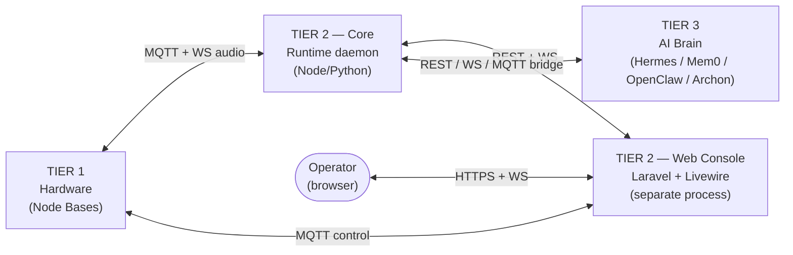
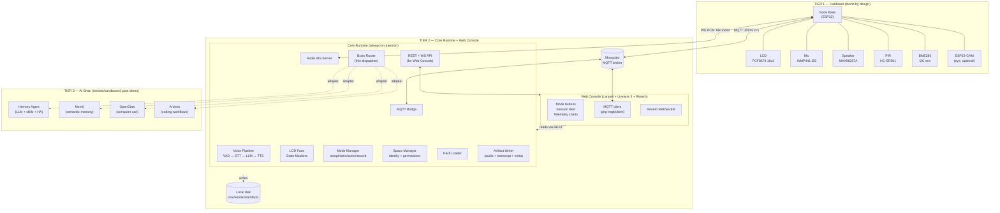
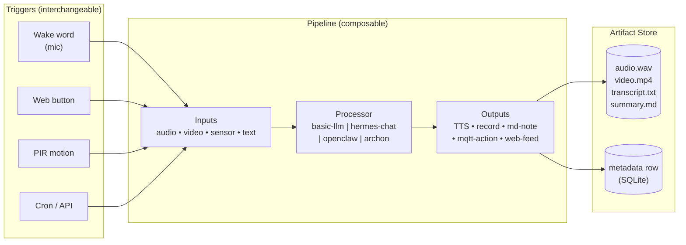
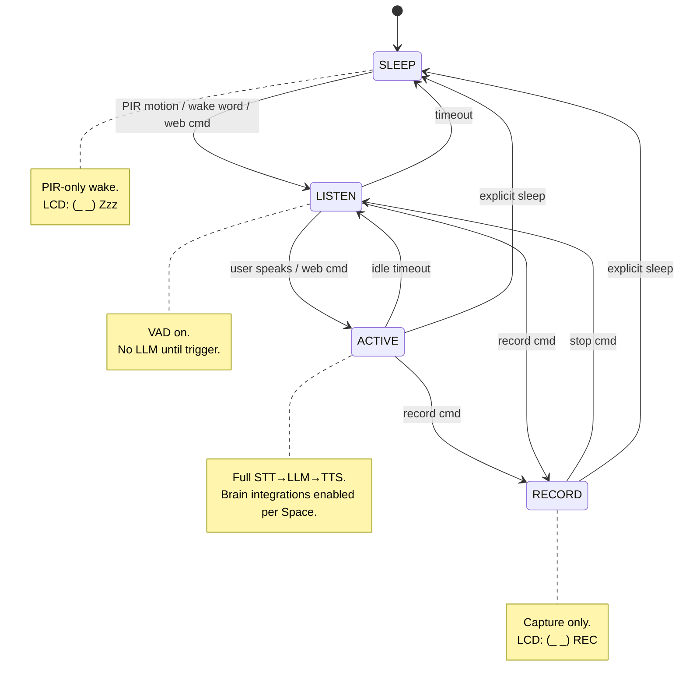
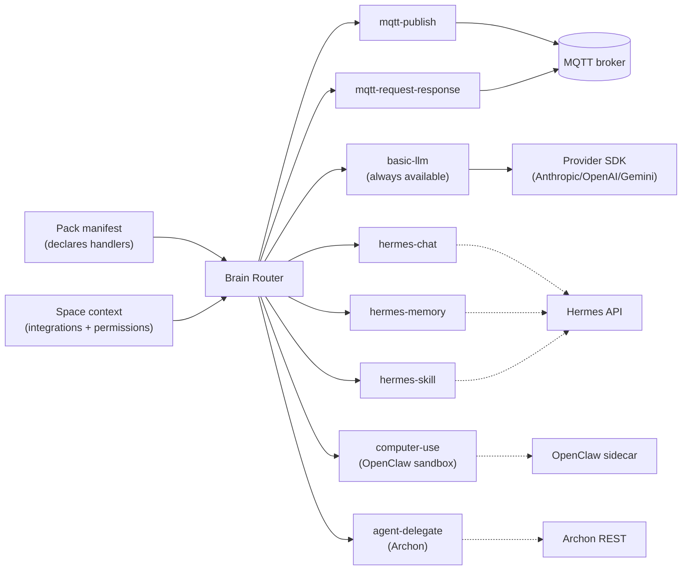
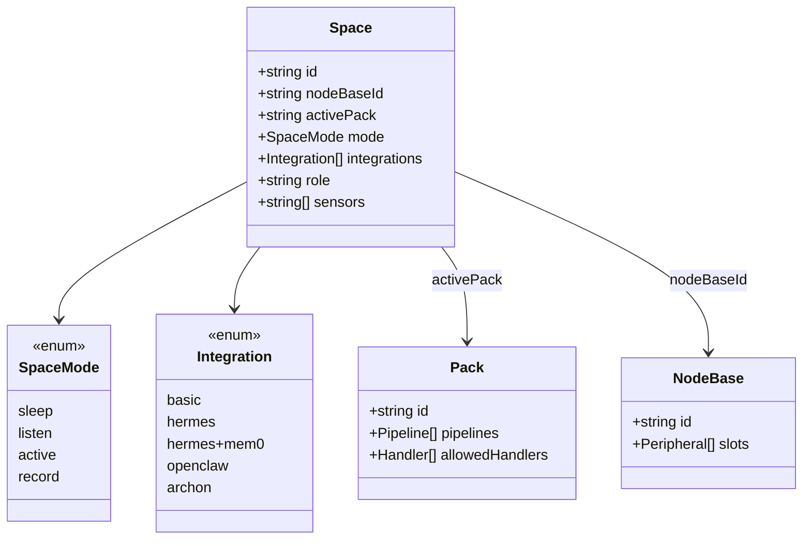
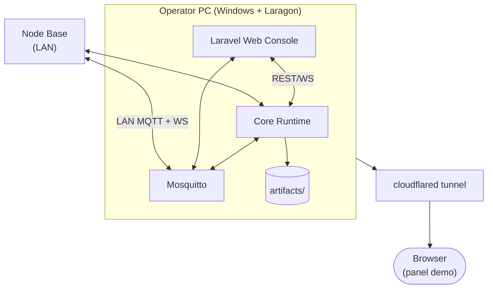
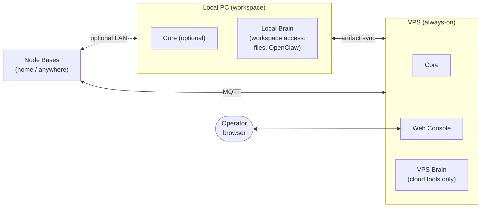
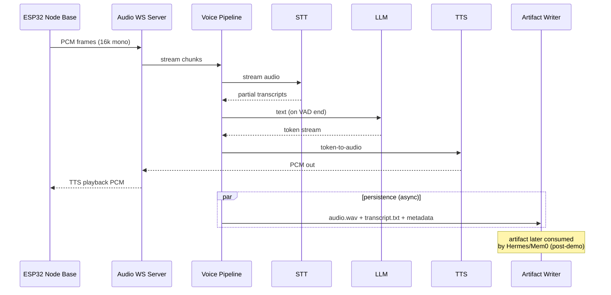

# Xentient Architecture

> Visual reference. Source of truth for *structure* — for *intent* see `VISION.md`, for *contracts* see `CONTRACTS.md`, for *hardware* see `HARDWARE.md`.

L1 Architecture — the shape of the system. All diagrams use Mermaid; render in GitHub or any Mermaid viewer.

---

## 1. The One-Sentence Model

> **Xentient is a bridge.** A physical room (Tier 1) talks to a swappable AI brain (Tier 3) through a thin, always-on Core (Tier 2) with a separate web console as its human surface.



**Key idea:** Core and Web are *different processes*. Either can crash without taking the other down. They share data, never memory.

---

## 2. Three-Tier Component Map



---

## 3. The Event Pipeline (Trigger → Pipeline → Output → Artifact)

The processing model is **not** "voice in, voice out." That is one specialization of a generic pattern.



Pipelines are declared per Pack. Triggers, processors, and outputs are all enum-gated handler types — **no arbitrary code**.

---

## 4. Mode State Machine



---

## 5. Brain Router — Dispatch Table

The Brain Router is a thin, **enum-gated** dispatcher. Adding a new handler type requires a harness PR — that is the security model.



| Handler | Tier | Available when |
|---|---|---|
| `mqtt-publish` / `mqtt-request-response` | T1 via T2 | Always |
| `basic-llm` | T2 local | Always (fallback) |
| `hermes-chat` / `hermes-memory` / `hermes-skill` | T3 | Space has `hermes` integration |
| `computer-use` | T3 sandbox | Space has `openclaw` integration |
| `agent-delegate` | T3 | Space has `archon` integration |

---

## 6. Spaces — Identity, Permissions, Modes

A Space is "a user account, but for a room." It binds *what hardware*, *what pack*, *what mode*, *what brain*.



**Mem0 scoping mirrors this:** facts are tagged with `space_id`, `user_id`, `role`, or left untagged (global). Same brain, different recall depending on which Space is talking.

---

## 7. Demo vs Platform Topology

### Demo (Apr 24) — single PC + tunnel



Brain tier = **basic-llm only** (direct provider call). Hermes/Mem0/OpenClaw/Archon are **deferred** to platform.

### Platform (post-demo) — local PC + VPS, two brains



**Principle:** the brain's reach is bounded by where it runs. Don't pretend the VPS brain can read local files — route those tasks to the local brain when it's online.

---

## 8. Voice Pipeline — Realtime Path (Demo Critical Path)



The artifact saved here is the **bridge** between realtime (room reacts now) and async brain (later, Hermes can re-process it: whisper-large transcription, vision-LLM summary, semantic indexing → push back to operator's web feed).

---

## 9. Process & Port Map

| Process | Tech | Port(s) | Lives where (demo) | Lives where (platform) |
|---|---|---|---|---|
| Mosquitto | broker | 1883 (MQTT), 9001 (WS) | Operator PC | VPS |
| Core Runtime | Node.js or Python | REST 8080, audio WS 8081 | Operator PC | VPS (optionally local too) |
| Web Console | Laravel 12 + Livewire 3 | HTTPS 443 (via tunnel), Reverb 8082 | Operator PC | VPS |
| Hermes Agent | Python process | configured per install | — (deferred) | local PC or VPS |
| Mem0 | Docker | 8888 | — | VPS |
| OpenClaw | Docker sidecar | 8889 | — | local PC |
| Archon | Python | 8890 | — | local PC |

---

## 10. What Lives Where (Codebase)

```
xentient/                         ← this repo
├── core/                         ← Tier 2 Core Runtime (Node or Python)
│   ├── engine/
│   │   ├── Pipeline.ts           ← voice pipeline
│   │   ├── BrainRouter.ts        ← thin dispatcher (post-demo)
│   │   ├── ModeManager.ts        ← state machine
│   │   └── SpaceManager.ts       ← identity/permissions
│   ├── comms/
│   │   ├── MqttClient.ts
│   │   └── AudioServer.ts
│   ├── adapters/                 ← post-demo
│   │   ├── HermesAdapter.ts
│   │   ├── Mem0Adapter.ts
│   │   ├── OpenClawAdapter.ts
│   │   └── ArchonAdapter.ts
│   ├── providers/                ← LLM/STT/TTS SDKs (existing)
│   └── packs/                    ← bot brains (folder = pack)
├── firmware/                     ← Tier 1 ESP32 code
│   ├── config/peripherals.h
│   └── shared/messages.h         ← mirrors core contracts
└── docs/                         ← this folder

xentient-web/                     ← SEPARATE Laravel repo (Tier 2 Web)
├── app/Livewire/
├── app/Mqtt/                     ← php-mqtt/client
├── routes/
└── resources/
```

The Web Console is its **own repo / own deploy** — co-located here in docs only because it's part of the system story.

---

## 11. Decision Boundaries (What We Will Not Cross)

| Line | Why |
|---|---|
| Core never embeds an AI brain | Brains are external processes — keeps Core thin and swappable |
| Web never `fopen()`s artifacts directly | Goes through Core REST + signed URL. Even when co-hosted. |
| Handlers are enum-gated, not dynamic | No `eval`, no plugin loading, no arbitrary code paths. New handler = harness PR. |
| One pack active per space | No multi-pack composition in v1 |
| No firmware hot-swap detection | Compile-time peripheral map (B4 dropped) |
| Basic mode always works | If every brain integration is offline, the room still responds |

---

## 12. Reading Order

1. **`VISION.md`** — *why* (the bridge model, what we own vs delegate)
2. **`ARCHITECTURE.md`** — *what shape* (this document)
3. **`CONTRACTS.md`** — *how they talk* (MQTT schemas, REST endpoints, WS frames)
4. **`HARDWARE.md`** — *what physical* (B1–B7 locked decisions)
5. **`WEB_CONTROL.md`** — *the human surface* (Web Console L2 spec)
6. **`PACKS.md`** / **`SPACES.md`** — *the configuration model*
7. **`WIRING.md`** — *the cable map*
