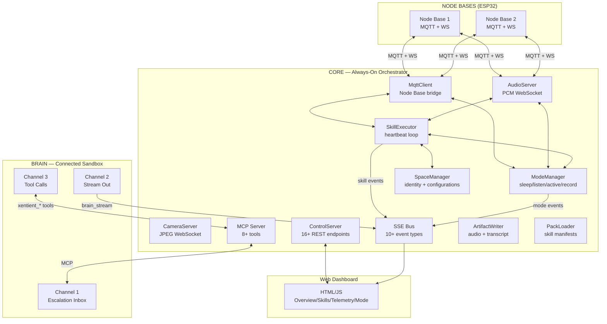
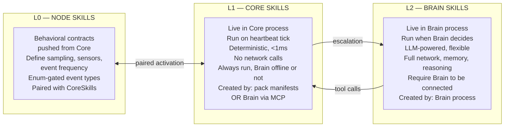
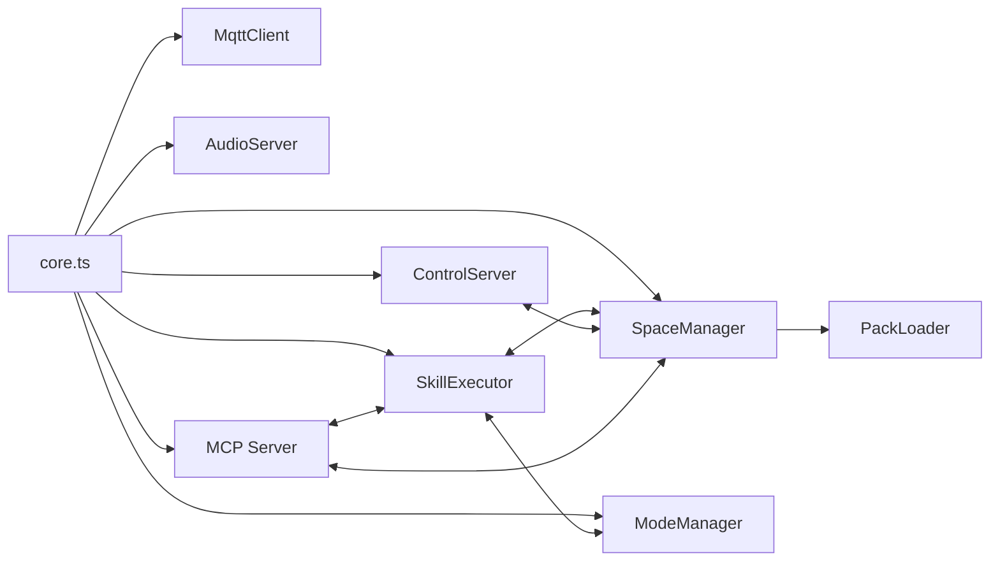
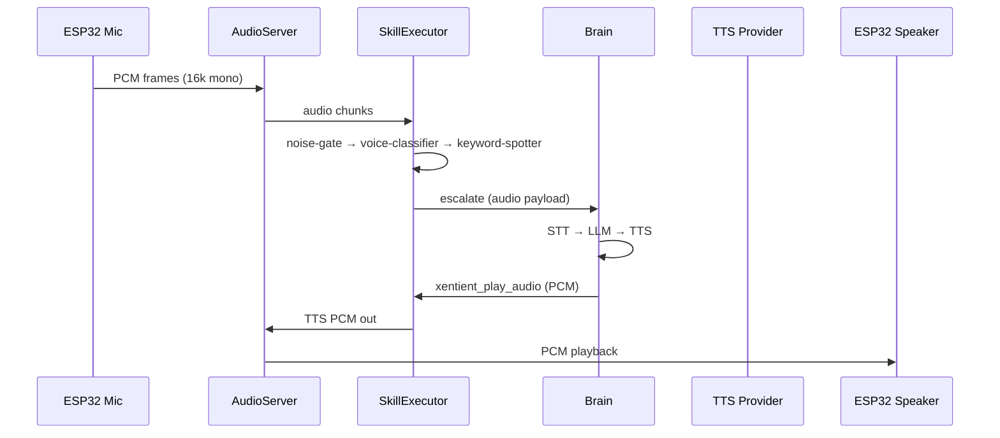
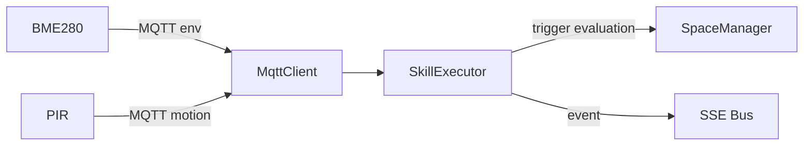
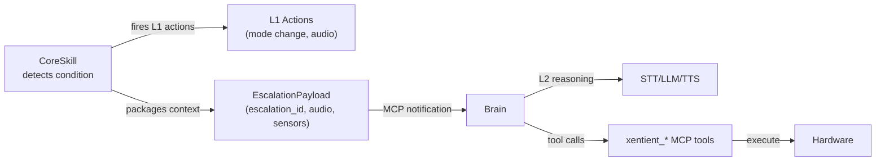
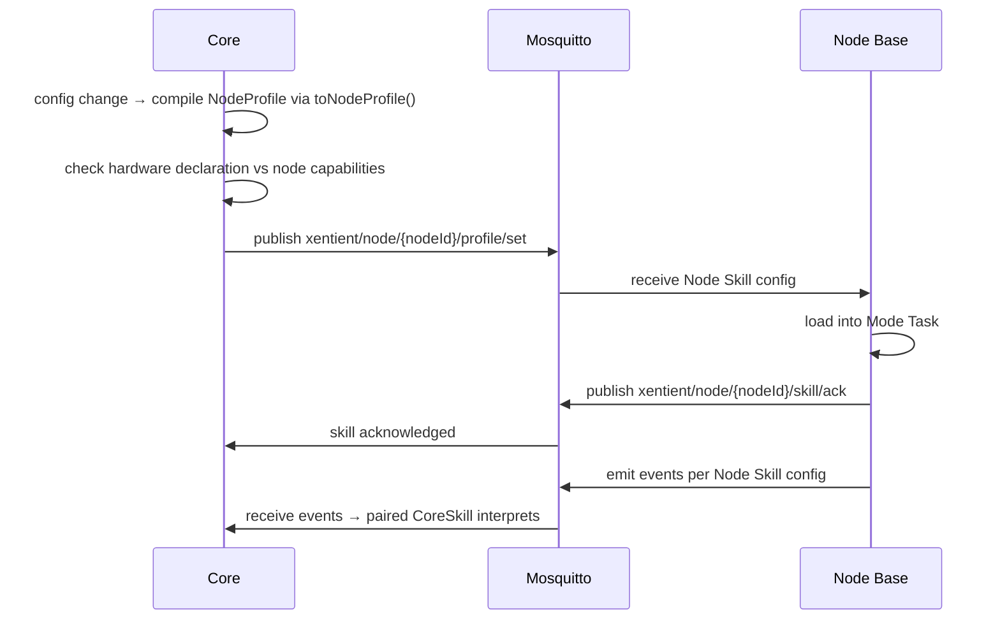
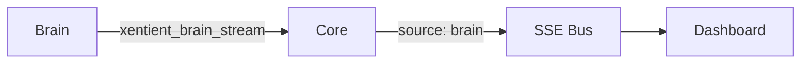

# Xentient Architecture

> Source of truth for *structure* — for *intent* see `CONTEXT.md`, for *contracts* see `CONTRACTS.md`, for *hardware* see `HARDWARE.md`.

---

## 1. System Overview

**Xentient is a room that thinks.** Two processes: Core (always-on) and Brain (connected sandbox). The room is the constant, the brain is the variable.



**Key idea:** Core and Brain are separate processes. Core never stops. Brain can disconnect, reconnect, or be swapped. Core is the room. Brain is the guest.

---

## 2. Three-Layer Skill Continuum



**Pairing Invariant:** A Node Skill and its counterpart CoreSkill(s) are always activated together. Core never pushes a Node Skill without knowing what to do with its output.

**Escalation Bridge (L1 → L2):**
Core Skill detects condition → fires L1 actions immediately → packages context → sends to Brain via MCP notification → Brain runs L2 reasoning → Brain calls back Core MCP tools → Core executes hardware actions.

---

## 3. Core Architecture (What's Built)

All paths reference actual source files in `harness/src/`.

| Component | File | Role |
|-----------|------|------|
| Entrypoint | `core.ts` | Starts all subsystems, wires dependencies |
| SkillExecutor | `engine/SkillExecutor.ts` | Heartbeat loop: tick → evaluate triggers → fire actions → escalate |
| SpaceManager | `engine/SpaceManager.ts` | Space identity, configurations, node assignments, ack tracking |
| ModeManager | `engine/ModeManager.ts` | State machine: sleep/listen/active/record |
| PackLoader | `engine/PackLoader.ts` | Load skill manifests from `packs/` directories |
| MqttClient | `comms/MqttClient.ts` | Bridge to ESP32 Node Bases via Mosquitto |
| AudioServer | `comms/AudioServer.ts` | PCM WebSocket in/out + camera JPEG relay |
| ControlServer | `comms/ControlServer.ts` | REST API (16+ endpoints) + static dashboard |
| MCP Server | `mcp/` | 8+ `xentient_*` tools for Brain connection |
| ArtifactWriter | (in pipeline) | Saves audio/transcript/metadata to disk |
| SSE Bus | `mcp/events.ts` | 10+ event types relayed to Dashboard |



---

## 4. Brain Interface (3 Channels)

Any MCP client can be a Brain. The interface is the contract, not the implementation.

### Channel 1: Escalation Inbox

Core pushes escalations when a CoreSkill detects a condition that requires Brain reasoning. Every escalation gets a unique `escalation_id`.

```typescript
interface EscalationPayload {
  escalation_id: string        // unique per escalation, groups Brain Feed events
  skill_id: string
  space_id: string
  mode: CoreNodeState           // dormant or running
  timestamp: number
  audio?: string               // base64 PCM
  sensor_snapshot?: SensorSnapshot
  context?: Record<string, unknown>
}
```

### Channel 2: Stream Out

Brain calls `xentient_brain_stream` to push reasoning tokens, tool calls, and status back to Core. Core relays these to the SSE bus with `source: "brain"`.

```typescript
interface BrainStreamEvent {
  escalation_id: string        // always present, ties event to its escalation
  subtype: BrainStreamSubtype
  payload: unknown
  timestamp: number
}

type BrainStreamSubtype =
  | "reasoning_token"
  | "tool_call_fired"
  | "tool_call_result"
  | "tts_queued"
  | "escalation_received"
  | "escalation_complete"
```

### Channel 3: Tool Calls Back to Core

Brain calls `xentient_*` MCP tools to act on the room: play audio, register skills, change modes, push node skills, write artifacts. See `docs/CONTRACTS.md` for full tool schemas.

### Reference Implementations

- **brain-basic.ts** — Minimal Brain (Channel 1 + 3 only, no streaming)
- **brain/hermes/HermesAdapter.ts** — Full Brain (all three channels)

### Building a Custom Brain

The minimum viable Brain is a script that: (a) connects to Core's MCP server, (b) subscribes to escalation notifications, (c) calls Core MCP tools to respond. Streaming is optional. Memory is optional. Tool use is optional.

---

## 5. Node Skills

Node Skills are behavioral contracts pushed from Core to Node Bases via MQTT. They configure sampling behavior, active sensors, event emission frequency, and local state machines. See `docs/NODE-SKILLS.md` for the full spec.

**Key properties:**
- Always paired with a CoreSkill (pairing invariant)
- Enum-gated event types (no arbitrary MQTT floods)
- Hardware capability declarations checked before push
- Core won't push a camera skill to a node with no camera

---

## 5a. NodeProfile Compilation Pipeline

When a configuration is activated, Core compiles each node's assigned NodeSkill into a firmware-ready `NodeProfile` via `toNodeProfile()` in `engine/nodeProfileCompiler.ts`. This is a two-layer contract model:

```
NodeSkill (Core-level)  →  toNodeProfile()  →  NodeProfile (firmware-level)
```

**NodeSkill** lives in the pack manifest. It declares `requires` (hardware), `sampling`, `emits` (event types), and `compatibleConfigs`.

**NodeProfile** is the compiled binary payload pushed to the ESP32 over MQTT. It contains the `eventMask` (bitmask), `micMode` (0=off, 1=vad-only, 2=always-on), sensor intervals, and LCD strings — everything the firmware Mode Task needs.

The compilation step (`toNodeProfile()`) checks hardware compatibility, maps event type strings to bitmask bits, and validates `micMode`. If a node lacks required hardware, the compiler returns `null` and Core falls back to the default profile.

---

## 5b. Configuration Transitions & Ack Timeout

Configuration changes are not immediate — they go through a `TransitionQueue` in SpaceManager. This ensures:

1. **Ordered transitions:** If Brain rapidly switches config A → B → C, they execute in order, not as a race.
2. **Ack tracking:** When Core pushes a `NodeProfile` to a node, it starts a 5-second ack timer. If the node doesn't respond with `node_profile_ack` within 5 seconds, Core marks the node `dormant` and emits a `xentient/node_offline` notification.
3. **Reconnect replay:** On MQTT reconnect (`onMqttReconnect()`), Core re-enqueues the active configuration for all spaces. This ensures firmware stuck on `DEFAULT_PROFILE` after a broker restart catches up.

```
activateConfig("classroom")
  → TransitionQueue.enqueue({type: 'activate_config', configName: 'classroom'})
  → drain() → executeConfigTransition()
    → for each node: toNodeProfile(nodeSkill, node) → MQTT publish
    → pendingAcks.set(nodeId, { timeout: 5s })
    → on ack: clearTimeout, mark node 'running'
    → on timeout: mark node 'dormant', notify Brain via xentient/node_offline
```

---

## 6. Data Flows

### Audio Flow



### Sensor Flow



### Skill Escalation Flow



### Node Skill Push Flow



### Brain Feed Flow



---

## 7. Known Architecture Debt

| Item | Status | Notes |
|------|--------|-------|
| **Pipeline.ts in Core** | Active and working | Do NOT delete until `brain/VoiceResponder.ts` is proven in its place. The refactor is a **migration, not a deletion** — run both in parallel until Brain Channel 1 and 3 are confirmed working end-to-end. Cutover point: when brain-basic can receive an escalation, call STT/LLM/TTS, and call `xentient_play_audio` successfully. Then Pipeline.ts gets removed. |
| **PIR wake bug (9id)** | Open | Firmware ISR works, harness gap in ModeManager sleep→listen transition |
| **Camera not forwarded to Brain** | Not built | CameraServer streams to dashboard but doesn't relay frames to Brain via MCP |

---

## 8. Process & Port Map

| Process | Tech | Port(s) | Lives where |
|---------|------|---------|-------------|
| Mosquitto | broker | 1883 (MQTT), 9001 (WS) | LAN |
| Core Runtime | Node.js | REST 3000, audio WS 8081, MCP stdio | Operator PC / VPS |
| Web Dashboard | Static HTML/JS | Served by ControlServer on :3000 | Served by Core |
| brain-basic | Node.js | connects to Core MCP | Same host or remote |

---

## 9. What Lives Where (Codebase)

```
xentient/                         ← this repo
├── harness/                      ← Core Runtime (Node.js)
│   ├── src/
│   │   ├── core.ts               ← always-on orchestrator entrypoint
│   │   ├── engine/
│   │   │   ├── SkillExecutor.ts   ← heartbeat loop executing CoreSkills
│   │   │   ├── ModeManager.ts     ← sleep/listen/active/record
│   │   │   ├── SpaceManager.ts    ← identity + configurations + ack tracking
│   │   │   ├── TransitionQueue.ts ← ordered config transition queue
│   │   │   ├── nodeProfileCompiler.ts ← NodeSkill → NodeProfile compilation
│   │   │   ├── PackLoader.ts      ← load skill manifests from packs/
│   │   ├── mcp/
│   │   │   ├── server.ts          ← MCP server (Brain connects here)
│   │   │   ├── tools.ts           ← xentient_* MCP tools
│   │   │   └── events.ts          ← SSE event bus
│   │   ├── comms/
│   │   │   ├── MqttClient.ts      ← Node Base bridge
│   │   │   ├── AudioServer.ts     ← PCM + JPEG WebSocket
│   │   │   └── ControlServer.ts   ← REST API + static dashboard
│   │   └── shared/
│   │       ├── contracts.ts       ← Zod schemas
│   │       └── contracts-schemas.ts
│   ├── public/                    ← Web Dashboard (static HTML/JS/CSS)
│   ├── packs/                     ← Pack manifests + skills
│   └── tests/                     ← Vitest suites
├── brain/                          ← Brain (SEPARATE PROCESS)
│   ├── index.ts                   ← Brain entrypoint
│   ├── hermes/
│   │   └── HermesAdapter.ts       ← Hermes Agent wrapper
│   ├── pipeline/
│   │   └── VoiceResponder.ts      ← STT → LLM → TTS
│   └── adapters/
│       ├── Mem0Adapter.ts
│       └── OpenClawAdapter.ts
├── firmware/                       ← ESP32 Node Base (C++)
│   ├── src/
│   │   ├── main.cpp               ← FreeRTOS two-task model
│   │   ├── mqtt_client.cpp
│   │   ├── lcd_driver.cpp
│   │   ├── i2s_mic.cpp
│   │   ├── vad.cpp
│   │   ├── ws_audio.cpp
│   │   ├── cam_relay.cpp
│   │   └── bme_reader.cpp
│   ├── include/
│   └── shared/
│       └── messages.h              ← mirrors contracts.ts
└── docs/                           ← this directory
```

---

## 10. Decision Boundaries (What We Will Not Cross)

| Line | Why |
|------|-----|
| Core never embeds an AI brain | Brains are external processes — keeps Core thin and swappable |
| Brain never talks to hardware directly | All hardware goes through Core MCP tools |
| Core continues if Brain disconnects | The room never bricks. L1 skills keep running. |
| Handlers are enum-gated, not dynamic | No `eval`, no plugin loading, no arbitrary code paths. New handler = harness PR. |
| One pack active per space | No multi-pack composition in v1 |
| Node Skills are pushed by Core, not self-selected | Configuration authority lives in Core, not in hardware |
| Brain streams via Core, not directly to Dashboard | Core owns the observability bus. Brain is a producer, not a publisher. |

---

## 11. Reading Order

1. **`CONTEXT.md`** — *why* (the vision, the skill continuum, what needs to change)
2. **`ARCHITECTURE.md`** — *what shape* (this document)
3. **`BRAIN-INTERFACE.md`** — *how Brain connects* (3-channel spec)
4. **`NODE-SKILLS.md`** — *how Node Skills work* (L0 behavioral contracts)
5. **`SKILLS.md`** — *what a skill is* (unified reference across all layers)
6. **`CONTRACTS.md`** — *how they talk* (MQTT, REST, SSE, MCP, Node Skill, Brain Stream)
7. **`HARDWARE.md`** — *what's wired* (BOM, pinouts, wiring decisions)
8. **`PACKS.md`** / **`SPACES.md`** — *the configuration model*