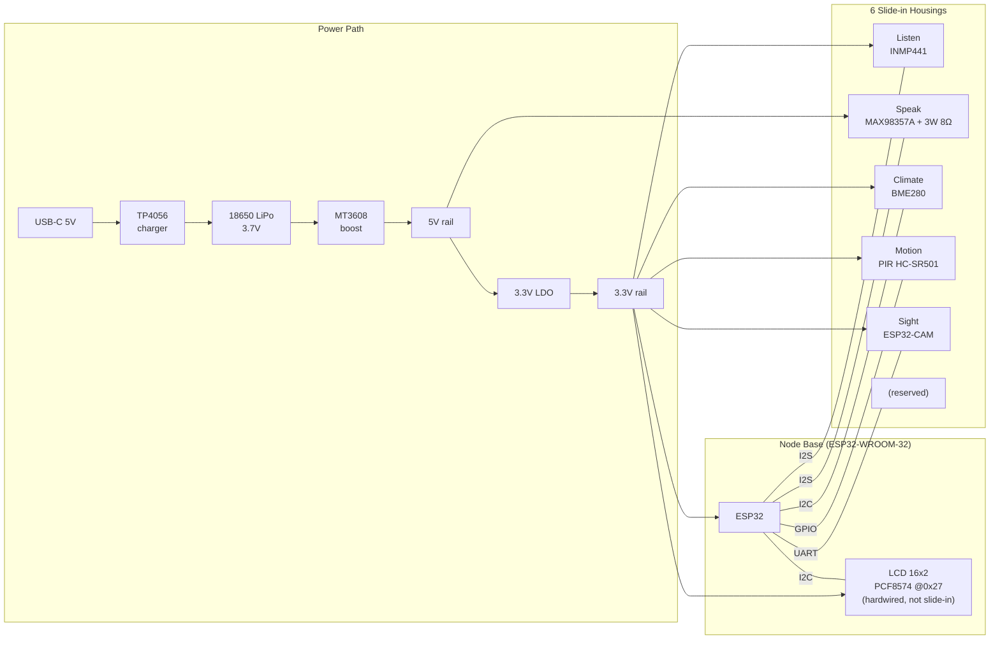
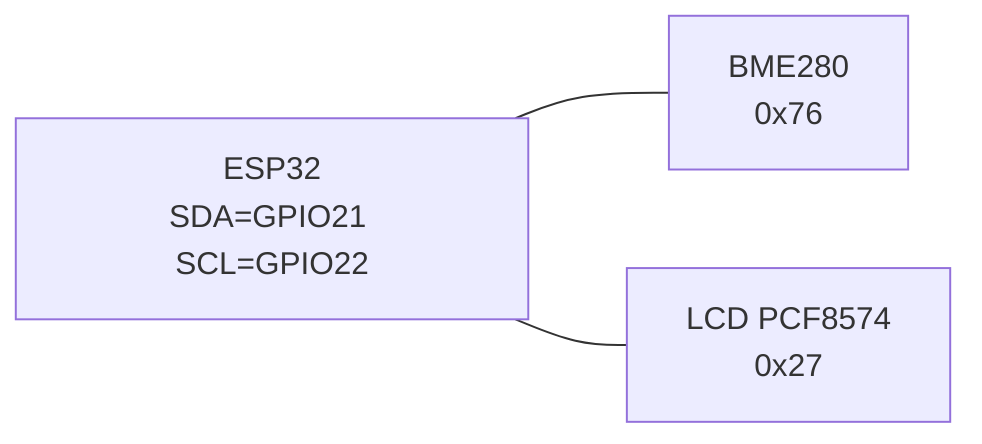
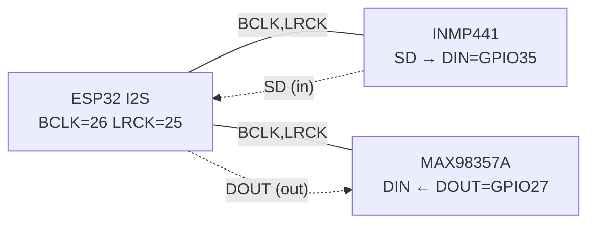

# Xentient — Wiring & Connections (Source of Truth)

> Live diagram of every wire, bus, and pin between the **Node Base** (ESP32-WROOM-32) and its 6 peripheral housings. Update this file BEFORE soldering or moving a wire. Firmware `peripherals.h` and the breadboard must match this doc, in that priority.
>
> **Status:** DRAFT — breadboard validation pending. Pin assignments marked `?` are unresolved.
> **Last edited:** 2026-04-19
> **Companion docs:** [HARDWARE.md](HARDWARE.md) (locked decisions), [CONTRACTS.md](CONTRACTS.md) (message schema)

---

## 1. System Overview

---

## 2. Housing → Bus → Connector Matrix

| Housing  | Component(s)                | Bus         | Voltage | JST    | Notes                                      |
|----------|-----------------------------|-------------|---------|--------|--------------------------------------------|
| Listen   | INMP441                     | I2S (in)    | 3.3V    | 6-pin  | L/R pin → GND (mono left)                  |
| Speak    | MAX98357A + 3W 8Ω speaker   | I2S (out)   | 5V      | 6-pin  | Amp needs 5V for full SPL; logic 3.3V-tol  |
| Climate  | BME280                      | I2C         | 3.3V    | 6-pin* | 6-pin JST soldered but only 4 used; CSB/SDO NC |
| Motion   | PIR HC-SR501                | GPIO        | 3.3V    | 4-pin  | 3 active (VCC/GND/OUT) + 1 NC; no 3-pin in BOM |
| Sight    | ESP32-CAM (OV2640)          | UART        | 5V      | 4-pin  | Must be flashed independently first        |
| LCD      | 16x2 + PCF8574 @0x27        | I2C         | 3.3V    | 4-pin  | **Hardwired to dock**, not a slide-in slot |

\* Climate housing: 6-pin JST physically present, but only VCC/GND/SDA/SCL are wired. CSB and SDO are left unconnected (SDO tied LOW on breakout = 0x76).

---

## 3. ESP32 GPIO Map (DRAFT — needs breadboard validation)

| Function        | Pin       | Direction | Goes to               | Status |
|-----------------|-----------|-----------|------------------------|--------|
| I2C SDA         | GPIO21    | bidir     | BME280, LCD            | ✅ VALIDATED 2026-04-20 |
| I2C SCL         | GPIO22    | out       | BME280, LCD            | ✅ VALIDATED 2026-04-20 |
| I2S BCLK        | GPIO26    | out       | INMP441 SCK, MAX98357 BCLK | ✅ VALIDATED 2026-04-20 |
| I2S LRCK / WS   | GPIO25    | out       | INMP441 WS, MAX98357 LRC   | ✅ VALIDATED 2026-04-20 |
| I2S DIN (mic)   | GPIO35    | in        | INMP441 SD              | ✅ VALIDATED 2026-04-20 — left ch, >>16 shift, peak ~2200 loud |
| I2S DOUT (amp)  | GPIO27    | out       | MAX98357 DIN            | ✅ resolved (was GPIO22 conflict) |
| PIR interrupt   | GPIO13    | in        | PIR OUT                 | ⏳ not yet tested |
| CAM UART TX     | GPIO17    | out       | ESP32-CAM RX (GPIO3)    | ✅ VALIDATED 2026-04-21 — PONG RTT=1ms |
| CAM UART RX     | GPIO16    | in        | ESP32-CAM TX (GPIO1)    | ✅ VALIDATED 2026-04-21 — PONG RTT=1ms |
| LCD             | shared    | -         | I2C bus                 | ✅     |

### Open pin questions

1. ~~**I2S DOUT vs I2C SCL on GPIO22**~~ — **RESOLVED:** I2S DOUT moved to GPIO27. No conflict.
2. ~~**CAM on UART0**~~ — **RESOLVED:** Using UART2 (TX=GPIO17, RX=GPIO16). UART0 avoided — keeps USB-serial debug live during CAM operation.

---

## 4. I2C Bus Map

| Address | Device         | Housing | Notes                     |
|---------|----------------|---------|---------------------------|
| 0x27    | PCF8574 (LCD)  | dock    | Hardwired                 |
| 0x76    | BME280         | Climate | SDO tied LOW = 0x76       |
| (0x77)  | BME280 alt     | -       | Avoid — keep SDO low      |

Pull-ups: 4.7kΩ to 3.3V on SDA + SCL, mounted on the Node Base PCB (one set for the whole bus).

---

## 5. I2S Bus Map

Single I2S peripheral block on the ESP32 services BOTH the mic (in) and the amp (out) on shared BCLK/LRCK with separate data lines.

- Format: 16 kHz, 16-bit S16LE mono (per HARDWARE.md §B3).
- INMP441 L/R pin tied to GND → channel = LEFT.
- MAX98357 GAIN pin: leave floating (default 9 dB) for breadboard; tune later.

---

## 6. Module Wiring (per JST connector)

> Colors in **bold** are actually soldered; *italic* are recommended standard for unsoldered modules.

### Climate — BME280 (4-pin active, 6-pin JST soldered)

| Pin | Color    | Signal | Module Pad | Notes          |
|-----|----------|--------|------------|----------------|
| 1   | **Red**  | VCC    | VIN        | 3.3V          |
| 2   | **Black**| GND    | GND        |                |
| 3   | **Yellow**| SDA   | SDI/SDA    |                |
| 4   | **White**| SCL    | SCK/SCL    |                |

Removed: SDO (was Yellow), CSB (was Blue) — SDO tied LOW on breakout = 0x76; CSB unused.

### Speak — MAX98357A (6-pin JST)

| Pin | Color      | Signal | Module Pad | Notes                         |
|-----|------------|--------|------------|-------------------------------|
| 1   | **Yellow** | VCC    | VIN        | 5V for full SPL               |
| 2   | **Black**  | GND    | GND        |                               |
| 3   | **Red**    | BCLK   | BCLK       |                               |
| 4   | **Green**  | LRCK   | LRC        |                               |
| 5   | *Green*    | DATA   | DIN        | **Not yet soldered** → GPIO27 |
| 6   | **White**  | GAIN   | GAIN       | Leave floating (default 9 dB)|

Speaker wires: **Red** (+), **Black** (−)

### Listen — INMP441 (6-pin JST, soldered)

| Pin | Color      | Signal | Module Pad | Notes              |
|-----|------------|--------|------------|--------------------|
| 1   | **Red**    | VCC    | VDD        | 3.3V (VDD = VCC)  |
| 2   | **Black**  | GND    | GND        |                    |
| 3   | **Green**  | BCLK   | SCK        |                    |
| 4   | **White**  | LRCK   | WS         |                    |
| 5   | **Yellow** | DATA   | SD         | → GPIO35           |
| 6   | **Blue**   | L/R    | L/R        | → GND (mono left)  |

### Motion — PIR HC-SR501 (4-pin JST, 3 active + 1 NC, not yet soldered)

| Pin | Color    | Signal | Notes                  |
|-----|----------|--------|------------------------|
| 1   | *Red*    | VCC    | 3.3V–5V (PIR tolerant)|
| 2   | *Black*  | GND    |                        |
| 3   | *White*  | OUT    | → GPIO13               |
| 4   | *—*      | NC     | Unused (4-pin JST, no 3-pin in BOM) |

### Sight — ESP32-CAM (4-pin JST, not yet soldered)

| Pin | Color    | Signal | Notes                              |
|-----|----------|--------|------------------------------------|
| 1   | *Red*    | VCC    | 5V recommended for stability       |
| 2   | *Black*  | GND    |                                    |
| 3   | *White*  | TX     | ESP32-CAM TX → Node Base RX (GPIO16) |
| 4   | *Yellow* | RX     | ESP32-CAM RX ← Node Base TX (GPIO17) |

### LCD — 16x2 PCF8574 (4-pin JST, not yet soldered)

| Pin | Color    | Signal | Notes |
|-----|----------|--------|-------|
| 1   | *Red*    | VCC    | 3.3V  |
| 2   | *Black*  | GND    |       |
| 3   | *White*  | SDA    |       |
| 4   | *Yellow* | SCL    |       |

---

## 7. Breadboard Validation Order

Per HARDWARE.md, build and prove on breadboard BEFORE designing the dock PCB:

1. **Power path** — TP4056 → 18650 → MT3608 → 5V → 3.3V LDO. Measure rails with multimeter.
2. **I2C bus** — BME280 + LCD on shared SDA/SCL. Run `Wire` scanner sketch, expect `0x27` and `0x76`. ✅ PASS 2026-04-20
3. **I2S mic** — INMP441 capture on GPIO35. Left channel confirmed, >>16 shift, peak ~2200 loud/~50 silence. ✅ PASS 2026-04-20
4. **PIR** — GPIO13 attachInterrupt, log motion events. Standalone 3-pin connector.
5. **ESP32-CAM** — flash independently first ✅, then connect via 4-wire UART2 (GPIO16/17). Run `cam_uart` validation sketch — expect PONG replies to PING.

Each step → tick the box and update the affected section above with the actually-wired pins. Diagram drift = bugs.

---

## 8. Change Log

- 2026-04-19 — Initial draft. Captured housing matrix, GPIO draft, flagged GPIO22 conflict and CAM UART0 concern as open questions.
- 2026-04-19 — Major restructure. Split "Sense" into standalone "Climate" (BME280) and "Motion" (PIR) modules. Resolved GPIO22 conflict: I2S DOUT moved to GPIO27. Added 3-pin GPIO connector spec. Updated ESP32-CAM notes (independent flash, 4-wire UART). 6 housings total (was 5).
- 2026-04-19 — Replaced generic JST pinout tables with per-module wiring tables showing actual soldered wire colors (Climate, Speak) and recommended standard colors (Listen, Motion, Sight, LCD). Flagged Speak DIN wire as not yet soldered.
- 2026-04-20 — 1xi VALIDATION PASS: I2C scanner confirmed LCD 0x27 + BME280 0x76. I2S mic read confirmed INMP441 on left channel (L/R=GND), >>16 shift correct. Calibrated: silence ~0.001 RMS / ~50 peak, normal speech ~0.02 RMS / ~1600 peak, loud/near ~0.04 RMS / ~2200 peak. VAD thresholds 1000/600 confirmed appropriate. Marked PIR as not yet tested.
- 2026-04-21 — UART2 decision locked: CAM uses GPIO17 (TX) / GPIO16 (RX). UART0 avoided to keep USB-serial debug live. Updated §3 GPIO map, §6 Sight table, §7 step 5. Added cam_uart validation sketch.
- 2026-04-21 — 02i VALIDATION PASS: UART2 link confirmed. Node Base GPIO16/17 ↔ ESP32-CAM GPIO1/3. PING/PONG RTT=1ms, 0% loss after CAM boot. ESP32-CAM MB used (direct USB, no FTDI).
