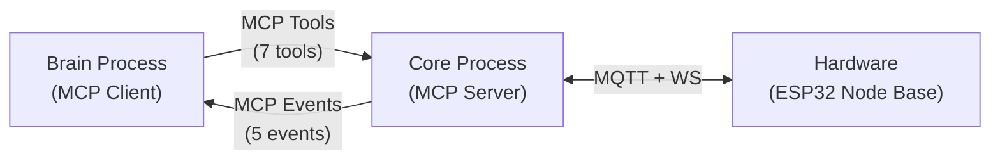

# Alignment Correction Implementation Plan

> **For agentic workers:** REQUIRED SUB-SKILL: Use superpowers:subagent-driven-development (recommended) or superpowers:executing-plans to implement this plan task-by-task. Steps use checkbox (`- [ ]`) syntax for tracking.

**Goal:** Fix all misalignments across docs, beads, and plans so the entire project consistently reflects the MCP Shell architecture — Brain Router is legacy, Core is a thin MCP server, and all dates, priorities, and file references point in the same direction.

**Architecture:** This is a documentation and metadata correction pass, not a code change. We update ARCHITECTURE.md, NON_GOALS.md, VISION.md, and the MCP Shell implementation plan to reflect the approved MCP architecture. We also reprioritize beads and create new tracking beads.

**Tech Stack:** Markdown, git, beads (bd)

---

## File Structure

### Modified Files

| File | Change |
|------|--------|
| `docs/ARCHITECTURE.md:48-51` | Replace Voice Pipeline in Core subgraph with MCP Server; move Voice Pipeline to Brain |
| `docs/ARCHITECTURE.md:167-201` | Rewrite §5 from Brain Router to MCP Brain Interface |
| `docs/ARCHITECTURE.md:256` | Update demo date from Apr 24 to Apr 27 |
| `docs/ARCHITECTURE.md:352-379` | Update codebase structure to MCP Shell layout |
| `docs/NON_GOALS.md` | Update demo date, remove stale items, add MCP as in-scope |
| `docs/VISION.md` | Add MCP Shell reference, update Brain Router/Comm Bridge refs, fix Apr 24 dates |
| `docs/superpowers/plans/2026-04-25-mcp-shell-implementation.md` | Restructure task order, integrate all 11 RFs, fix file paths |
| `docs/ARCHITECTURE-REFINEMENT-core-as-mcp.md` | Add SUPERSEDED notice |
| `docs/CONTRACTS_ARTIFACTS.md:44` | Update demo date from Apr 24 to Apr 27 |
| `docs/PACKS.md:258,289,361` | Replace "Brain Router" with "MCP tool registry"; update Apr 24 to Apr 27 |
| `docs/SPACES.md:235` | Update demo date from Apr 24 to Apr 27 |
| `docs/repurpose.md` | Add SUPERSEDED notice (replaced by MCP Shell); update all Apr 24 dates; annotate Tool Router/Comm Bridge as legacy |
| `docs/INTEGRATIONS/openclaw.md:127` | Note that P7 Communication Bridge is now MCP Shell |
| `docs/VALIDATION-2026-04-25.md` | Mark PIR and 0xA0 issues as IN PROGRESS |

### Bead Updates

| Bead ID | Change |
|---------|--------|
| Xentient-9id | Add note: "Blocks MCP motion_detected event. Hardware validation required." |
| Xentient-b94 | Reprioritize from P1 to P0 |
| Xentient-7lm | Reprioritize from P2 to P1 |

### New Beads

| Title | Type | Priority |
|-------|------|----------|
| Doc alignment corrections (this spec) | task | P1 |
| MCP Shell plan integration (RF integration, reordering) | task | P0 |

---

## Task 1: Update Demo Date in ARCHITECTURE.md (P0 — CR-3)

**Files:**
- Modify: `docs/ARCHITECTURE.md`

- [ ] **Step 1: Find and replace all "Apr 24" occurrences**

Search `docs/ARCHITECTURE.md` for all instances of "Apr 24" and replace with "Apr 27":

- Line ~256: `"Demo (Apr 24)"` → `"Demo (Apr 27)"`
- Any other occurrences of "Apr 24" in the file

- [ ] **Step 2: Verify the changes**

Run: `grep -n "Apr 24" docs/ARCHITECTURE.md`
Expected: No matches (all replaced with Apr 27)

Run: `grep -n "Apr 27" docs/ARCHITECTURE.md`
Expected: At least 1 match (the demo date reference)

- [ ] **Step 3: Commit**

```bash
git add docs/ARCHITECTURE.md
git commit -m "fix(docs): update demo date from Apr 24 to Apr 27 in ARCHITECTURE.md"
```

---

## Task 2: Rewrite NON_GOALS.md v1 Demo Section (P0 — CR-4)

**Files:**
- Modify: `docs/NON_GOALS.md`

- [ ] **Step 1: Replace the v1 Demo Non-Goals section**

Replace the entire `## v1 Demo Non-Goals (through Apr 24)` section (lines 5-19) with:

```markdown
## v1 Demo Non-Goals (through Apr 27)

These do NOT ship before the Apr 27 demo. The demo runs the new MCP Shell architecture (Core + Brain-basic).

- No Hermes/Mem0/OpenClaw/Archon integration code ships before demo (brain-basic is the only brain)
- No Pack system, no Space Manager (4 hardcoded modes only)
- No Provider SDK npm publish (post-demo)
- No Visual Builder / web UI (ControlServer + test.html only)
- No extensible mode registry (4 hardcoded modes for demo, config-driven modes post-demo)

The demo ships: PIR wake, voice pipeline (STT → LLM → TTS), MQTT hardware bridge, LCD display, MCP Shell architecture.
```

- [ ] **Step 2: Verify the changes**

Run: `grep -n "Apr 24" docs/NON_GOALS.md`
Expected: No matches

Run: `grep -n "Apr 27" docs/NON_GOALS.md`
Expected: 1 match in the section header

Run: `grep -n "No Mode Manager" docs/NON_GOALS.md`
Expected: No matches (removed since ModeManager is already built)

Run: `grep -n "No Communication Bridge" docs/NON_GOALS.md`
Expected: No matches (replaced with more specific MCP scope)

- [ ] **Step 3: Commit**

```bash
git add docs/NON_GOALS.md
git commit -m "fix(docs): update NON_GOALS.md — demo date, remove stale items, add MCP scope"
```

---

## Task 3: Restructure MCP Shell Implementation Plan (P0 — CR-8, CR-9, CR-10)

This is the largest task. It requires rewriting the implementation plan to:
1. Move install deps (Task 5 in old plan) to Task 0 (CR-9)
2. Integrate all 11 Review Fixes into their respective tasks (CR-10)
3. Fix all file path references to consistently use `harness/src/` prefix (CR-8)

**Files:**
- Modify: `docs/superpowers/plans/2026-04-25-mcp-shell-implementation.md`

- [ ] **Step 1: Restructure the plan header and task order**

Update the plan header to reflect the restructured task order. The new task numbering:

```
Task 0:  Install deps (vitest + MCP SDK) — was Task 5
Task 0.5: Create test helper mocks — NEW (from gap analysis)
Task 1:  Fix audio 0xA0 prefix (P0-2) — unchanged
Task 2:  Remove dead VAD subscription (P0-3) — unchanged
Task 3:  Fix contracts timestamp + LCD faces (P0 minor) — unchanged
Task 4:  Wire PIR ISR in firmware (P0-1) — unchanged
Task 5:  Create MCP types + schemas — was Task 6
Task 6:  Create MCP tool handlers — was Task 7
Task 7:  Create MCP event bridge (with RF-3 fix) — was Task 8
Task 8:  Create MCP server module (with RF-6, RF-7 fixes) — was Task 9
Task 9:  Create core.ts entry point (with RF-2, RF-4, RF-5, T-19, T-22) — was Task 10
Task 10: Add REST endpoints to ControlServer (with RF-11 fix) — was Task 11
Task 11: Add ModeManager.reconfigureHardware — was Task 12
Task 12: Create BrainPipeline (MCP client) — was Task 13
Task 13: Create brain-basic.ts (with RF-8, RF-9, T-20) — was Task 14
Task 14: Update build scripts (with T-21) — was Task 15
Task 15: Integration smoke test (with T-0.5 mocks) — was Task 16
Task 16: Delete BrainRouter.ts (with GAP-9 audit) — was Task 17
```

- [ ] **Step 2: Integrate RF-1 (task reordering)**

The task order is already restructured in Step 1. Task 0 (install deps) now comes before all test-writing tasks. Update the File Structure section to reflect `harness/` prefix consistently on all paths.

- [ ] **Step 3: Integrate RF-2 (pino stderr) into Tasks 8, 9**

In Task 8 (MCP server module), update the pino logger line:
```typescript
const logger = pino({ name: "mcp-server" }, process.stderr);
```

In Task 9 (core.ts), update ALL pino logger lines:
```typescript
const logger = pino({ name: "xentient-core" }, process.stderr);
```

Add a new step in Task 9 that updates all existing module pino loggers to use `process.stderr`:
- `harness/src/comms/MqttClient.ts`
- `harness/src/comms/AudioServer.ts`
- `harness/src/comms/CameraServer.ts`
- `harness/src/comms/ControlServer.ts`
- `harness/src/engine/ModeManager.ts`
- `harness/src/engine/ArtifactWriter.ts`

Each should change from `pino({ name: "..." })` to `pino({ name: "..." }, process.stderr)`.

- [ ] **Step 4: Integrate RF-3 (VAD event source) into Task 7**

In Task 7 (event bridge), replace the `mqtt.on("vad", ...)` handler with:

```typescript
// Voice triggers come via xentient/control/trigger (not the dead vad topic)
mqtt.on("triggerPipeline", (data: unknown) => {
  const d = data as { source?: string };
  if (d.source === "voice" || d.source === "web" || d.source === "pir") {
    server.notification({
      method: MCP_EVENTS.voice_start,
      params: { timestamp: Date.now() },
    }).catch((err: Error) => logger.error({ err }, "Failed to send voice_start event"));
  }
});
```

- [ ] **Step 5: Integrate RF-4 (voice_end gap) into Task 9**

In Task 9 (core.ts), add audio buffer accumulation logic after the audioServer/modeManager wiring:

```typescript
// Audio buffer accumulation for voice_end events
let audioBuffer: Buffer[] = [];
let isListening = false;

audioServer.on("audioChunk", (chunk: Buffer) => {
  const mode = modeManager.getMode();
  if (mode === "active" || mode === "listen") {
    isListening = true;
    audioBuffer.push(chunk);
  }
});

// When VAD-end arrives (via triggerPipeline with source=voice and type=end),
// flush the buffer as a voice_end event
mqtt.on("triggerPipeline", (data: unknown) => {
  const d = data as { source?: string; type?: string };
  if (d.source === "voice" && d.type === "end" && isListening) {
    const combined = Buffer.concat(audioBuffer);
    mcpServer.notification({
      method: MCP_EVENTS.voice_end,
      params: {
        timestamp: Date.now(),
        duration_ms: combined.length / 32, // 16kHz * 2 bytes = 32 bytes/ms
        audio: combined.toString("base64"),
      },
    }).catch((err: Error) => logger.error({ err }, "Failed to send voice_end event"));
    audioBuffer = [];
    isListening = false;
  }
});
```

Add a note: "This requires the firmware to publish a VAD-end trigger. If unavailable for demo, use silence detection or timer-based fallback. See GAP-1 in gap analysis spec."

- [ ] **Step 6: Integrate RF-5 (SensorCache extraction) into Task 5**

In Task 5 (MCP types), add a note that `SensorCache` should be moved to `harness/src/shared/types.ts` once created, and import it from there in both `tools.ts` and `ControlServer.ts`. For now, define it in `tools.ts` and note the dependency.

- [ ] **Step 7: Integrate RF-6 (BME280 constant) into Task 7**

In Task 7 (event bridge), use the constant instead of magic number:
```typescript
import { PERIPHERAL_IDS } from "../shared/contracts";
// ...
if (d.peripheralType === PERIPHERAL_IDS.BME280) {
```

- [ ] **Step 8: Integrate RF-7 (unused imports) into Task 8**

In Task 8 (MCP server module), remove the unused imports:
```typescript
// REMOVE these from server.ts:
// import { MQTT_TOPICS, AUDIO_WS_PREFIX } from "../shared/contracts";
```

- [ ] **Step 9: Integrate RF-8 (require.resolve portability) into Task 13**

In Task 13 (brain-basic.ts), use `path.resolve` instead of `require.resolve`:
```typescript
import { resolve } from "path";
// ...
const transport = new StdioClientTransport({
  command: process.execPath,
  args: [resolve(__dirname, "core.js")],
});
```

Same fix in the integration test (Task 15).

- [ ] **Step 10: Integrate RF-9 (MCP SDK API verification) into Task 13**

Add a verification step before writing handler code in Task 13:
"Verify `setNotificationHandler` signature in MCP SDK by checking `node_modules/@modelcontextprotocol/sdk/dist/client.d.ts`. If it requires Zod schemas, define notification schemas in `types.ts` and use them."

- [ ] **Step 11: Integrate RF-11 (REST endpoint test mocking) into Task 10**

In Task 10 (ControlServer REST endpoints), replace the direct HTTP test with a proper mocked test that starts ControlServer on port 0 (random):

```typescript
// tests/control-server-rest.test.ts
import { describe, it, expect, vi, beforeAll, afterAll } from "vitest";
import { ControlServer } from "../src/comms/ControlServer";
// Mock MqttClient, ModeManager, CameraServer, SensorCache
// Start server on port 0 (random), run tests, close in afterAll
```

- [ ] **Step 12: Fix all file path references to use `harness/src/` prefix**

Search the entire plan for file references like `src/core.ts`, `src/mcp/types.ts`, etc. and ensure they all use `harness/src/` prefix:
- `src/core.ts` → `harness/src/core.ts`
- `src/brain-basic.ts` → `harness/src/brain-basic.ts`
- `src/mcp/` → `harness/src/mcp/`
- `src/comms/` → `harness/src/comms/`
- `src/engine/` → `harness/src/engine/`
- `src/shared/` → `harness/src/shared/`
- `src/brain-basic/` → `harness/src/brain-basic/`
- `src/brain/` → `harness/src/brain/`

- [ ] **Step 13: Remove the Review Fixes appendix**

Delete the entire "Review Fixes" section from the plan. All fixes are now integrated into their respective tasks.

- [ ] **Step 14: Verify the restructured plan is consistent**

Check that:
- Task 0 installs deps before any tests are written
- All RFs are integrated into task steps (no appendix needed)
- All file paths use `harness/src/` prefix
- Task numbers are sequential and referenced correctly
- Self-review section reflects new task numbers

- [ ] **Step 15: Commit**

```bash
git add docs/superpowers/plans/2026-04-25-mcp-shell-implementation.md
git commit -m "fix(plan): restructure MCP Shell plan — integrate RFs, fix task order, fix file paths"
```

---

## Task 4: Rewrite ARCHITECTURE.md §5 — Brain Interface (P1 — CR-1)

**Files:**
- Modify: `docs/ARCHITECTURE.md:167-201`

- [ ] **Step 1: Rewrite §5 from "Brain Router — Dispatch Table" to "Brain Interface — MCP Tools & Events"**

Replace the entire §5 section (lines 167-201) with:

```markdown
## 5. Brain Interface — MCP Tools & Events

The Brain Interface connects Xentient's hardware to any MCP-compatible AI process. The Core exposes its capabilities as an MCP server; Brain processes connect as MCP clients. This replaces the legacy Brain Router concept.

> **Legacy note:** The Brain Router was an enum-gated dispatcher with hardcoded adapter types (`hermes-chat`, `hermes-memory`, `computer-use`, `agent-delegate`). It has been superseded by the MCP Shell architecture. See `docs/ARCHITECTURE-REFINEMENT-core-as-mcp.md` for the evolution rationale.



### MCP Tools (Core → Brain)

| Tool | Purpose |
|------|---------|
| `xentient_read_sensors` | Read temperature, humidity, pressure, motion |
| `xentient_read_mode` | Read current mode (sleep/listen/active/record) |
| `xentient_set_mode` | Set mode with valid transitions |
| `xentient_play_audio` | Play base64-encoded PCM s16le audio through speaker |
| `xentient_set_lcd` | Send text/expression to LCD display |
| `xentient_capture_frame` | Capture latest camera frame as base64 JPEG |
| `xentient_mqtt_publish` | Publish JSON payload to MQTT topic |

### MCP Events (Core → Brain, push-based)

| Event | Trigger |
|-------|---------|
| `xentient/motion_detected` | PIR sensor triggered |
| `xentient/voice_start` | VAD detected speech onset |
| `xentient/voice_end` | VAD detected speech end (with audio buffer) |
| `xentient/mode_changed` | Mode state machine transition |
| `xentient/sensor_update` | Periodic BME280 telemetry |

### Key principle

Any MCP-compatible process can drive Xentient. The `brain-basic` process (STT→LLM→TTS) is the fallback that always works. Hermes, Archon, or any other agent can connect as alternative brains.
```

- [ ] **Step 2: Verify the section reads correctly**

Read through the updated section to ensure it flows logically and cross-references correctly.

- [ ] **Step 3: Commit**

```bash
git add docs/ARCHITECTURE.md
git commit -m "feat(docs): rewrite §5 as Brain Interface — MCP Tools & Events"
```

---

## Task 5: Update ARCHITECTURE.md §2 — Move Voice Pipeline, Add MCP Server (P1 — CR-2)

**Files:**
- Modify: `docs/ARCHITECTURE.md:48-51`

- [ ] **Step 1: Update the Core Runtime component map**

In the §2 Core Runtime subgraph, replace `VP["Voice Pipeline<br/>VAD → STT → LLM → TTS"]` with `MCP["MCP Server<br/>(tools + events)"]` and move Voice Pipeline to the Brain section.

Find the Core Runtime subgraph (around lines 49-61) and change:

```mermaid
subgraph CORE["Core Runtime (always-on daemon)"]
    direction TB
    MCP["MCP Server<br/>(tools + events)"]
    MQB["MQTT Bridge"]
    AS["Audio WS Server"]
    FACE["LCD Face<br/>State Machine"]
    MM["Mode Manager<br/>sleep/listen/active/record"]
    SM["Space Manager<br/>identity + permissions"]
    PL["Pack Loader"]
    ART["Artifact Writer<br/>(audio + transcript + meta)"]
    REST["REST + WS API<br/>(for Web Console)"]
end
```

Add a Brain subgraph:

```mermaid
subgraph BRAIN_BASIC["Brain Process (brain-basic, fallback)"]
    direction TB
    VP["Voice Pipeline<br/>VAD → STT → LLM → TTS"]
    PROV["Providers<br/>(Deepgram, OpenAI, ElevenLabs)"]
    VP --> PROV
end
```

- [ ] **Step 2: Update connections**

In the connections section, update:
- Remove: `BR -.adapter.-> HERMES` and related Brain Router lines
- Add: `BRAIN_BASIC -->|"MCP client"| MCP`
- Add a post-demo note showing how Hermes replaces brain-basic

- [ ] **Step 3: Commit**

```bash
git add docs/ARCHITECTURE.md
git commit -m "feat(docs): move Voice Pipeline to Brain layer, add MCP Server to Core"
```

---

## Task 6: Update ARCHITECTURE.md §10 — Codebase Structure (P1 — CR-5)

**Files:**
- Modify: `docs/ARCHITECTURE.md:352-379`

- [ ] **Step 1: Replace the codebase structure with MCP Shell layout**

Replace the §10 "What Lives Where" codebase structure (lines 352-379) with:

```
harness/src/
├── core.ts                    ← Core entry point (MCP server + hardware I/O)
├── brain-basic.ts             ← Brain entry point (MCP client + STT/LLM/TTS)
├── mcp/
│   ├── server.ts              ← MCP server with 7 tools
│   ├── tools.ts               ← Tool handler implementations
│   ├── events.ts              ← Event bridge (MQTT/VAD → MCP notifications)
│   └── types.ts               ← Zod schemas for MCP types
├── comms/
│   ├── MqttClient.ts          ← Stays in Core
│   ├── AudioServer.ts         ← Stays in Core (with 0xA0 prefix fix)
│   ├── CameraServer.ts        ← Stays in Core
│   └── ControlServer.ts       ← Stays in Core (REST + SSE + test.html)
├── engine/
│   ├── ModeManager.ts          ← Stays in Core (add reconfigureHardware)
│   └── ArtifactWriter.ts       ← Stays in Core
├── brain-basic/
│   ├── Pipeline.ts             ← Refactored to use MCP client calls
│   └── providers/              ← STT/LLM/TTS SDKs
├── shared/
│   ├── contracts.ts            ← Wire contracts (shared by both processes)
│   ├── contracts-schemas.ts
│   ├── contracts-verify.ts
│   └── types.ts                ← Shared interfaces (SensorCache, etc.)
└── firmware/                   ← Tier 1 ESP32 code
    ├── config/peripherals.h
    └── shared/messages.h         ← mirrors core contracts
```

- [ ] **Step 2: Commit**

```bash
git add docs/ARCHITECTURE.md
git commit -m "feat(docs): update codebase structure to MCP Shell architecture"
```

---

## Task 7: Update Bead Priorities and Dependencies (P1 — CR-6, CR-7)

- [ ] **Step 1: Update Xentient-b94 from P1 to P0**

```bash
bd update Xentient-b94 --priority 0
bd update Xentient-b94 --notes "Reprioritized to P0: 0xA0 prefix is demo-blocking — TTS breaks without it"
```

- [ ] **Step 2: Update Xentient-7lm from P2 to P1**

```bash
bd update Xentient-7lm --priority 1
bd update Xentient-7lm --notes "Implementation plan exists. Execute P0 fixes first (9id, b94, bgx), then MCP Shell implementation (Tasks 5-16)."
```

- [ ] **Step 3: Add hardware validation note to Xentient-9id**

```bash
bd update Xentient-9id --notes "Blocks MCP Shell motion_detected event. Hardware validation (PIR on GPIO13) must pass before closing this bead."
```

- [ ] **Step 4: Create bead for doc alignment corrections**

```bash
bd create --title="Doc alignment corrections — sync ARCHITECTURE.md, NON_GOALS.md, VISION.md with MCP Shell architecture" --description="Fix all misalignments identified in docs/superpowers/specs/2026-04-25-alignment-correction.md. P0: dates, NON_GOALS rewrite. P1: §5 rewrite, §2 update, §10 update. P2: VISION.md bridge, ARCHITECTURE-REFINEMENT superseded notice." --type=task --priority=1
```

- [ ] **Step 5: Create bead for MCP Shell plan integration**

```bash
bd create --title="MCP Shell plan integration — restructure plan, integrate all RFs, fix paths" --description="Restructure the MCP Shell implementation plan (docs/superpowers/plans/2026-04-25-mcp-shell-implementation.md): integrate all 11 Review Fixes into task steps, reorder tasks (install deps first), fix file path references to use harness/src/ prefix. Remove the RF appendix once all fixes are integrated." --type=task --priority=0
```

---

## Task 8: Add SUPERSEDED Notice to Architecture Refinement Doc (P2 — CR-11 partial)

**Files:**
- Modify: `docs/ARCHITECTURE-REFINEMENT-core-as-mcp.md`

- [ ] **Step 1: Add superseded notice at the top**

Add the following notice at the very top of the file, before the title:

```markdown
> **SUPERSEDED:** This document has been formalized into the MCP Shell architecture spec (`docs/superpowers/specs/2026-04-25-mcp-shell-gap-analysis.md`) and the implementation plan (`docs/superpowers/plans/2026-04-25-mcp-shell-implementation.md`). The architectural decisions captured here are now reflected in `docs/ARCHITECTURE.md` §5 (Brain Interface — MCP Tools & Events). This document is retained for historical reference only.

```

- [ ] **Step 2: Update the status from DRAFT to SUPERSEDED**

Change `> Status: DRAFT` to `> Status: SUPERSEDED`

- [ ] **Step 3: Commit**

```bash
git add docs/ARCHITECTURE-REFINEMENT-core-as-mcp.md
git commit -m "docs: mark ARCHITECTURE-REFINEMENT as superseded by MCP Shell spec"
```

---

## Task 9: Ensure VISION.md Has Bridge Philosophy (P2 — CR-11 partial)

**Files:**
- Modify: `docs/VISION.md` (if needed)

- [ ] **Step 1: Review VISION.md for Bridge philosophy**

Check that VISION.md already contains the key framing:
- "Xentient is a bridge" metaphor
- "We don't build the brain; we build the interface that allows any brain to inhabit the hardware"
- MCP Shell concept (thin Core, swappable Brain)

From the review above, VISION.md already has strong bridge framing in §1 ("The Reframe") and the "What Xentient Owns" section. However, it doesn't explicitly mention the MCP interface.

- [ ] **Step 2: Add MCP Shell reference to VISION.md**

Add a paragraph after the existing "Key shift" line (around line 17):

```markdown
**MCP Shell architecture (v2):** The Core is now a thin MCP server. Any MCP-compatible process can connect as a Brain — `brain-basic` (STT→LLM→TTS) is the always-works fallback, and Hermes or other agents can replace it by connecting to the same MCP tools and events. The Brain doesn't need to know Xentient's internals; it just calls tools and listens for events.
```

- [ ] **Step 3: Update demo date reference in VISION.md**

Search VISION.md for "Apr 24" and update any occurrences to "Apr 27":
- Line ~332: `"Demo (Apr 24)"` → `"Demo (Apr 27)"`
- Line ~392: `"**Demo Apr 24:**"` → `"**Demo Apr 27:**"`

- [ ] **Step 4: Commit**

```bash
git add docs/VISION.md
git commit -m "feat(docs): add MCP Shell reference to VISION.md bridge philosophy, update demo date"
```

---

## Task 10: Update VALIDATION Doc Status (P0)

**Files:**
- Modify: `docs/VALIDATION-2026-04-25.md`

- [ ] **Step 1: Mark issues #2 (PIR) and #5 (0xA0) as IN PROGRESS**

Open the validation doc and find issues #2 and #5. Update their status to indicate they have active beads:

For PIR (issue #2): Add `[IN PROGRESS — bead Xentient-9id]`
For 0xA0 prefix (issue #5): Add `[IN PROGRESS — bead Xentient-b94]`

- [ ] **Step 2: Commit**

```bash
git add docs/VALIDATION-2026-04-25.md
git commit -m "fix(docs): mark PIR and 0xA0 validation issues as in progress"
```

---

## Task 11: Fix CONTRACTS_ARTIFACTS.md Demo Date (P0)

**Files:**
- Modify: `docs/CONTRACTS_ARTIFACTS.md`

- [ ] **Step 1: Update demo date on line 44**

Change `### Demo (Apr 24) — Shared SQLite` to `### Demo (Apr 27) — Shared SQLite`

- [ ] **Step 2: Commit**

```bash
git add docs/CONTRACTS_ARTIFACTS.md
git commit -m "fix(docs): update demo date from Apr 24 to Apr 27 in CONTRACTS_ARTIFACTS.md"
```

---

## Task 12: Fix PACKS.md — Brain Router → MCP, Demo Date (P1)

**Files:**
- Modify: `docs/PACKS.md`

PACKS.md references "Brain Router" in 3 places and has a stale demo date. Since the Pack system is post-demo (P5), the MCP Shell architecture means packs will register MCP tools instead of Brain Router handlers. Add a migration note rather than rewriting the entire doc.

- [ ] **Step 1: Update Brain Router references**

Replace each occurrence:
- Line 258: `3. Parse \`tools.json\` → register tools with Brain Router` → `3. Parse \`tools.json\` → register tools via MCP tool registry`
- Line 289: `5. Atomically swap: load new pack, update Brain Router, push new LCD faces` → `5. Atomically swap: load new pack, update MCP tool registry, push new LCD faces`
- Line 361: `VISION.md (Brain Router handler table)` → `VISION.md (MCP Brain Interface)`

- [ ] **Step 2: Add MCP migration note**

After the Guardrails section (line ~311) or before the Demo Packs section (line ~333), add:

```markdown
> **MCP Shell migration note:** The Pack system currently describes tool registration via a "Brain Router" dispatcher. Under the MCP Shell architecture (post-demo), packs will expose MCP tool definitions that the Core server registers. The structural flow (load → validate → register → activate) remains the same; only the dispatch mechanism changes from enum-gated handlers to MCP tool schemas. See `docs/ARCHITECTURE.md` §5 for the MCP interface spec.
```

- [ ] **Step 3: Update demo date on line 335**

Change `Two packs planned for demo day (Apr 24).` to `Two packs planned for demo day (Apr 27).`

- [ ] **Step 4: Commit**

```bash
git add docs/PACKS.md
git commit -m "fix(docs): update PACKS.md — Brain Router→MCP, Apr 24→Apr 27"
```

---

## Task 13: Fix SPACES.md Demo Date (P0)

**Files:**
- Modify: `docs/SPACES.md`

- [ ] **Step 1: Update demo date on line 235**

Change `for Apr 24` to `for Apr 27` in: `The current harness ships with neither Mode Manager nor Space Manager for Apr 24.`

- [ ] **Step 2: Commit**

```bash
git add docs/SPACES.md
git commit -m "fix(docs): update demo date from Apr 24 to Apr 27 in SPACES.md"
```

---

## Task 14: Fix repurpose.md — Add SUPERSEDED Notice, Fix Dates, Annotate Legacy Architecture (P2)

**Files:**
- Modify: `docs/repurpose.md`

repurpose.md is a post-demo architecture vision document. It describes the "Communication Bridge" and "Tool Router" concepts that have been superseded by the MCP Shell architecture. Rather than rewriting the entire doc (which is still useful as a vision reference), add a superseded notice and annotate key legacy terms.

- [ ] **Step 1: Add superseded notice at the top**

Add after line 5 (the Scope line):

```markdown
> **SUPERSEDED — Architecture Evolution:** The "Communication Bridge" and "Tool Router" concepts described in this document have been replaced by the **MCP Shell architecture** (Core = MCP server, Brain = MCP client). See `docs/ARCHITECTURE.md` §5 for the current architecture. This document is retained for its vision framing and post-demo roadmap, but all "Bridge" and "Router" references are legacy terminology.

```

- [ ] **Step 2: Update all "Apr 24" dates to "Apr 27"**

- Line 5: `NOT implemented before Apr 24 demo` → `NOT implemented before Apr 27 demo`
- Line 530: `## Demo Day (Apr 24)` → `## Demo Day (Apr 27)`
- Line 551: `for Apr 24 demo` → `for Apr 27 demo`
- Line 572: `post-Apr 24` → `post-Apr 27`

- [ ] **Step 3: Add inline annotations for legacy terms**

At the first occurrence of each legacy term, add a parenthetical:

- Line 34: `Tool Router (thin)` → `Tool Router (thin) — *now superseded by MCP Shell interface*`
- Line ~354: `Communication Bridge` section header → add `— *now superseded by MCP Shell*`
- Line ~397: `Tool Router` section → add note: `> **Note:** The Tool Router has been replaced by the MCP Shell architecture. Brain processes now connect as MCP clients. See ARCHITECTURE.md §5.`

- [ ] **Step 4: Commit**

```bash
git add docs/repurpose.md
git commit -m "fix(docs): add SUPERSEDED notice, update dates, annotate legacy terms in repurpose.md"
```

---

## Task 15: Fix VISION.md — Communication Bridge and Brain Router References (P1)

**Files:**
- Modify: `docs/VISION.md`

Task 9 already adds MCP Shell to VISION.md, but misses 4 references to "Communication Bridge" and "Brain Router" that need annotation.

- [ ] **Step 1: Annotate Communication Bridge references**

Find and update these lines:
- ~Line 497: `│  Communication Bridge (Node.js)     │` → `│  Communication Bridge (Node.js)  ← *now MCP Shell*  │`
- ~Line 607: `P7: Communication Bridge` → `P7: Communication Bridge (*now MCP Shell interface*)`
- ~Line 614: The LOC estimate line mentioning "Brain Router" → change "Brain Router" to "MCP Brain Interface"
- ~Line 732: `Communication Bridge:` definition → append `(*now implemented as MCP Shell — Core is MCP server, Brain is MCP client*)`

- [ ] **Step 2: Verify no "Brain Router" references remain as active architecture**

Run: `grep -n "Brain Router" docs/VISION.md`
Expected: No matches (or only legacy annotations)

- [ ] **Step 3: Commit**

```bash
git add docs/VISION.md
git commit -m "fix(docs): annotate Communication Bridge and Brain Router as MCP Shell in VISION.md"
```

---

## Task 16: Annotate openclaw.md Communication Bridge Reference (P2)

**Files:**
- Modify: `docs/INTEGRATIONS/openclaw.md`

- [ ] **Step 1: Annotate P7 Communication Bridge**

At line 127, the phase table has `| P7: Communication Bridge | REST/WS/MQTT bridge to AI Brain | P1 |`. Add a note:

Change `| P7: Communication Bridge | REST/WS/MQTT bridge to AI Brain | P1 |` to `| P7: Communication Bridge | REST/WS/MQTT bridge to AI Brain (*now MCP Shell — see ARCHITECTURE.md §5*) | P1 |`

- [ ] **Step 2: Add superseded note for enum-gated handler references**

After line 93 (`3. **Handler enum-gated:**`), add a note:

```markdown
   > **MCP Shell migration:** Under the MCP Shell architecture, OpenClaw connects as an MCP client rather than a handler type. The `computer-use` handler pattern is retained for reference but will be replaced by MCP tool definitions post-demo.
```

- [ ] **Step 3: Commit**

```bash
git add docs/INTEGRATIONS/openclaw.md
git commit -m "fix(docs): annotate Communication Bridge and handler refs as MCP Shell in openclaw.md"
```

---

## Validation Checklist

After executing this plan, verify:

- [ ] `ARCHITECTURE.md` no longer mentions "Brain Router" as an active component (only as legacy note)
- [ ] `ARCHITECTURE.md` demo dates say "Apr 27" (not "Apr 24")
- [ ] `ARCHITECTURE.md` §2 Core subgraph shows MCP Server instead of Voice Pipeline
- [ ] `ARCHITECTURE.md` §5 describes MCP Brain Interface (7 tools, 5 events)
- [ ] `ARCHITECTURE.md` §10 shows MCP Shell codebase structure
- [ ] `NON_GOALS.md` demo date says "Apr 27"
- [ ] `NON_GOALS.md` no longer lists "No Mode Manager" as a non-goal
- [ ] `NON_GOALS.md` no longer lists "No Communication Bridge code" (replaced with specific MCP scope)
- [ ] `NON_GOALS.md` lists MCP Shell architecture as in-scope for demo
- [ ] `VISION.md` has MCP Shell reference in bridge philosophy
- [ ] `VISION.md` has no "Apr 24" references
- [ ] `VISION.md` Communication Bridge and Brain Router references annotated as MCP Shell
- [ ] `VALIDATION-2026-04-25.md` has PIR and 0xA0 issues marked IN PROGRESS
- [ ] `ARCHITECTURE-REFINEMENT-core-as-mcp.md` has SUPERSEDED notice
- [ ] `CONTRACTS_ARTIFACTS.md` demo date says "Apr 27"
- [ ] `PACKS.md` has no "Brain Router" references (replaced with "MCP tool registry")
- [ ] `PACKS.md` demo date says "Apr 27"
- [ ] `PACKS.md` has MCP migration note after Guardrails section
- [ ] `SPACES.md` demo date says "Apr 27"
- [ ] `repurpose.md` has SUPERSEDED notice at top
- [ ] `repurpose.md` has no "Apr 24" dates (all updated to Apr 27)
- [ ] `repurpose.md` Tool Router and Communication Bridge references annotated as legacy
- [ ] `openclaw.md` P7 Communication Bridge annotated as MCP Shell
- [ ] `openclaw.md` enum-gated handler reference has MCP migration note
- [ ] Implementation plan has all RFs integrated into tasks (no appendix)
- [ ] Implementation plan tasks are ordered: install deps → P0 fixes → P1 architecture
- [ ] Implementation plan file paths consistently use `harness/src/`
- [ ] Bead Xentient-9id has hardware validation note
- [ ] Bead Xentient-b94 reprioritized to P0
- [ ] Bead Xentient-7lm reprioritized to P1
- [ ] New beads created for doc alignment and plan integration
- [ ] Global search for "Apr 24" in `docs/` returns zero matches
- [ ] Global search for "Brain Router" in `docs/` returns only legacy annotations